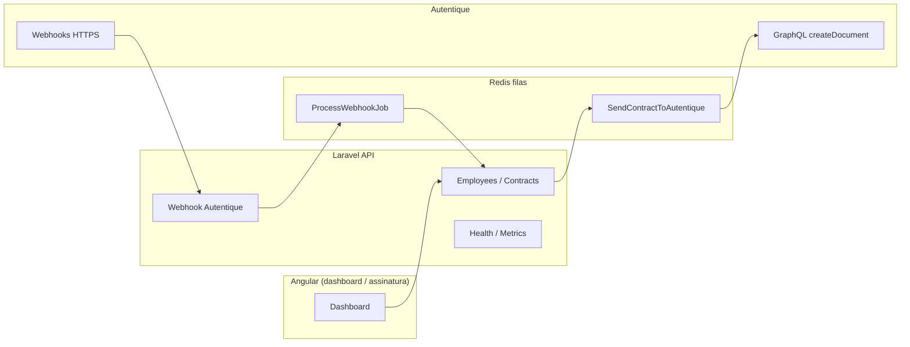

# SignRhFlow

Orquestração de **RH + contratos em PDF** com assinatura eletrônica na **Autentique**: criação de colaboradores, geração de documento, envio assíncrono (fila), consumo de **webhooks idempotentes** e painel de status.

> **Assinatura oficial na Autentique**; este app organiza dados de RH, PDF, fila, links e acompanhamento de status.

### Só usa Docker no PC?

Não precisa instalar PHP nem Node localmente. Veja **[`Docs/ComandosDocker.md`](Docs/ComandosDocker.md)** ou rode na raiz do repo (PowerShell):

```powershell
.\scripts\docker-api-test.ps1
.\scripts\docker-web-build.ps1
```

---

## Problema

Times de RH precisam gerar contratos repetidamente, enviar para assinatura em um provedor certificado e saber **quando** o documento foi assinado ou recusado — sem perder eventos duplicados nem sobrecarregar a API externa.

## Por que esta arquitetura

| Decisão | Motivo |
|--------|--------|
| **Fila (Redis + workers)** | Envio à Autentique é I/O pesado; desacopla a API HTTP do usuário, permite **retry com backoff** e não trava requisições. |
| **Webhook idempotente** | Provedores reenviam eventos; `event_hash` (SHA-256 do payload) garante **uma** fila de processamento por payload idêntico. |
| **Autentique como fonte de verdade** | O PDF “oficial” assinado e o fluxo legal ficam no provedor; aqui guardamos metadados, link e **status** para o dashboard. |
| **Rate limit** | Protege a API (`throttle:api`) e isola webhooks com limite dedicado (`throttle:webhooks`). |
| **HMAC do webhook** (opcional) | Com `AUTENTIQUE_WEBHOOK_SECRET`, validamos `X-Autentique-Signature` = HMAC-SHA256 do **corpo bruto**, conforme [documentação Autentique](https://docs.autentique.com.br/api/integration-basics/webhooks). |

### Diagrama (visão lógica)



## Repositório

- `signrhflow-api` — Laravel 12, OpenAPI/Swagger, PostgreSQL, Redis.
- `signrhflow-web` — Angular 17 (dashboard).
- `docker-compose.yml` — API, worker, web dev, Postgres, Redis.

Documentação operacional da API: [`signrhflow-api/README.md`](signrhflow-api/README.md).

## Demo gravada (1–2 min) — roteiro sugerido

Artefato manual: grave a tela seguindo o roteiro em **[`Docs/DemoScript.md`](Docs/DemoScript.md)** (criar contrato → fila → link Autentique → webhook → dashboard **SIGNED**).

## Observabilidade

- **Liveness:** `GET /up`
- **Readiness:** `GET /api/health` (DB + Redis) — ver [`Docs/Healthchecks.md`](Docs/Healthchecks.md)
- **Logs:** contexto de request (`request_id`, método, path) + eventos `webhook.autentique.*`; canal opcional `json` em `config/logging.php`
- **Métricas simples:** `GET /api/metrics` com `Authorization: Bearer <METRICS_TOKEN>` (rota só existe se `METRICS_TOKEN` estiver definido)

## Segurança e tokens

- **Webhook:** HMAC opcional (`AUTENTIQUE_WEBHOOK_SECRET`).
- **API token** (login do app): rotar periodicamente no backend / política da empresa.
- **Autentique:** rotacionar `AUTENTIQUE_API_TOKEN` no painel Autentique, atualizar `.env` e **redeploy**; jobs falharão com credencial inválida até atualizar.

## OpenAPI & exemplos cURL

Gere o Swagger após mudanças nas anotações (com a stack Docker no ar):

```powershell
docker compose exec api php artisan l5-swagger:generate
```

UI: `http://localhost:8000/api/documentation`

```bash
# Readiness
curl -sS http://localhost:8000/api/health | jq .

# Webhook (dev, sem secret configurado)
curl -sS -X POST http://localhost:8000/api/webhooks/autentique \
  -H "Content-Type: application/json" \
  -d '{"event_type":"document.signed","data":{"id":"UUID-DOCUMENTO"}}'

# Métricas (requer METRICS_TOKEN no .env)
curl -sS http://localhost:8000/api/metrics \
  -H "Authorization: Bearer SEU_METRICS_TOKEN"
```

## CI (GitHub Actions)

Workflow [`.github/workflows/ci.yml`](.github/workflows/ci.yml): `composer lint` + `php artisan test`, `npm run build` e testes Karma em Chrome headless.

## Casos de teste (automatizados — passo 2)

| Arquivo | Cenário |
|---------|---------|
| `tests/Feature/WebhookExtendedTest.php` | Payload legado (`documento.uuid` / `partes`), HMAC inválido/válido, idempotência por hash exato |
| `tests/Feature/AutentiqueSendRetryTest.php` | Falha HTTP na Autentique + segunda tentativa bem-sucedida no job |
| `tests/Feature/MetricsEndpointTest.php` | Proteção Bearer em `/api/metrics` |
| `tests/Feature/ContractFlowTest.php` | Fluxo feliz + duplicidade de webhook (já existente) |

```powershell
docker compose exec api bash -lc "composer run lint && php artisan test"
```

Ou: `.\scripts\docker-api-test.ps1` (na raiz do repositório). Detalhes em [`Docs/ComandosDocker.md`](Docs/ComandosDocker.md).

## Licença

MIT (ajuste conforme o projeto).
