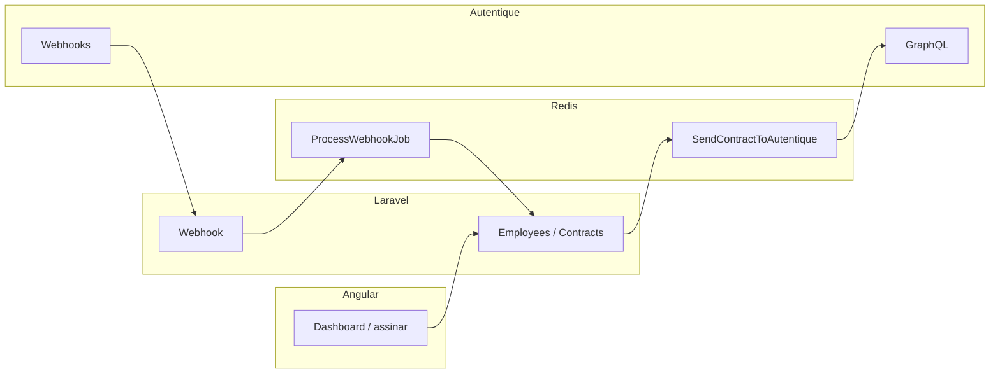

# SignRhFlow

Monorepo que integra **RH** (colaboradores, contratos, PDF) com assinatura eletrônica na **[Autentique](https://docs.autentique.com.br/api/2)** (GraphQL + webhooks). Backend em **Laravel**, frontend em **Angular**, filas em **Redis**.

---

## Índice

- [Resumo](#resumo)
- [Como rodar](#como-rodar)
- [Fluxo do produto](#fluxo-do-produto)
- [Repositório](#repositório)
- [Documentação](#documentação)
- [Qualidade e CI](#qualidade-e-ci)
- [Segurança e privacidade](#segurança-e-privacidade)
- [Licença](#licença)

---

## Resumo

| Camada | O que faz |
|--------|-----------|
| **API** | CRUD de colaboradores e contratos, geração de PDF, envio assíncrono à Autentique, webhook idempotente, health/métricas, OpenAPI. |
| **Web** | Dashboard e fluxo de assinatura por link (token). |
| **Infra local** | Docker Compose: API, worker, Postgres, Redis, opcionalmente build do front. |

Decisões principais: **fila** para I/O externo, **hash do payload** para idempotência de webhook, **HMAC opcional** do webhook, **Autentique** como fonte da verdade da assinatura.



---

## Como rodar

**Pré-requisitos:** Docker (e, para dev do front no host, Node 20 se preferir `ng serve`).

Na raiz do repositório:

```bash
docker compose up -d
docker compose exec api composer install
docker compose exec api php artisan key:generate
docker compose exec api php artisan migrate
docker compose exec api php artisan queue:work --queue=contracts,webhooks
```

- API: `http://localhost:8000` — Swagger: `/api/documentation` (gerar com `php artisan l5-swagger:generate` dentro do container).
- Readiness: `GET /api/health`
- Front (fora do Compose ou conforme seu `docker-compose`): `http://localhost:4200`

**Windows (scripts):** `.\scripts\docker-api-test.ps1`, `.\scripts\docker-web-build.ps1`  
**Comandos Docker detalhados:** [`Docs/ComandosDocker.md`](Docs/ComandosDocker.md)

Variáveis importantes (`.env` da API): `AUTENTIQUE_API_TOKEN`, `AUTENTIQUE_GRAPHQL_URL`, `AUTENTIQUE_WEBHOOK_SECRET` (opcional), `QUEUE_CONNECTION=redis`, `METRICS_TOKEN` (opcional).

---

## Fluxo do produto

1. Cadastro de **colaborador** (`POST /api/employees`).
2. Criação de **contrato** (`POST /api/contracts`): gera PDF, enfileira envio à Autentique.
3. **Job** envia o PDF via GraphQL; o contrato recebe `autentique_document_id` e link de assinatura; status tende a **PENDING**.
4. Signatário usa o **link** (`/assinar/:token` no front) e segue o fluxo até finalizar no app; a assinatura legal ocorre na Autentique.
5. **Webhook** `POST /api/webhooks/autentique` recebe eventos; processamento em background atualiza status (**SIGNED** / **REJECTED**) sem processar o mesmo payload duas vezes (hash).

Demo gravada: roteiro em [`Docs/DemoScript.md`](Docs/DemoScript.md).

---

## Repositório

| Pasta | Conteúdo |
|-------|----------|
| `signrhflow-api/` | Laravel 12, PostgreSQL, Redis, filas, Swagger |
| `signrhflow-web/` | Angular 17 |
| `docker-compose.yml` | Serviços locais |
| `Docs/` | Guias, healthchecks, planos |

---

## Documentação

| Arquivo | Descrição |
|---------|-----------|
| [`Docs/BACKEND_GUIDE_PT.md`](Docs/BACKEND_GUIDE_PT.md) | **Tour completo do backend PHP** (iniciantes) |
| [`signrhflow-api/README.md`](signrhflow-api/README.md) | Comandos rápidos da API |
| [`Docs/ComandosDocker.md`](Docs/ComandosDocker.md) | Docker |
| [`Docs/Healthchecks.md`](Docs/Healthchecks.md) | `/up` vs `/api/health` |
| [`Docs/LGPD.md`](Docs/LGPD.md) | Notas de privacidade |

Integração externa: [Autentique API v2](https://docs.autentique.com.br/api/2).

---

## Qualidade e CI

- **GitHub Actions:** [`.github/workflows/ci.yml`](.github/workflows/ci.yml) — Pint + PHPUnit (API), build + Karma (web).
- **Dependabot:** [`.github/dependabot.yml`](.github/dependabot.yml) — Composer, npm, Actions.
- Testes API: `docker compose exec api php artisan test` — ver também tabela de cenários na pasta `signrhflow-api/tests/Feature/`.

---

## Segurança e privacidade

- Webhook: validação **HMAC** quando `AUTENTIQUE_WEBHOOK_SECRET` está definido.
- Tokens: rotacionar `AUTENTIQUE_API_TOKEN` e credenciais do app em produção.
- **Melhoria recomendada para produção:** exigir `RequireApiTokenAuth` nas rotas de RH (`employees`, `contracts`) e ajustar testes — hoje o front já envia Bearer após login, mas a API aceita essas rotas sem token (adequado para demo, frágil em produção).

Mais detalhes: [`Docs/LGPD.md`](Docs/LGPD.md).

---

## Licença

MIT (ajuste se necessário).
